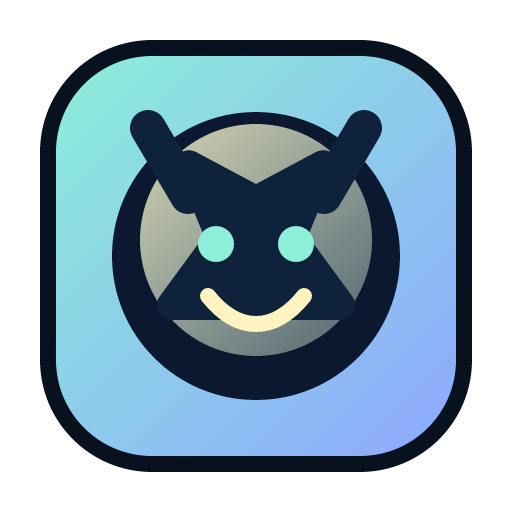

# Companion OS

<p align="center">
  
</p>

<p align="center">
  <strong>A local-first desktop companion with real tools, real personality, and visible presence.</strong>
</p>

<p align="center">
  Companion OS is building toward one persistent AI companion that lives on your desktop, helps with useful tasks, and feels like a character you keep around, not just another chat tool.
</p>

<p align="center">
  <a href="https://github.com/Khaniixx/companion-os/actions/workflows/ci.yml"></a>
  <a href="https://github.com/Khaniixx/companion-os/actions/workflows/codeql.yml"></a>
  <a href="https://github.com/Khaniixx/companion-os/actions/workflows/tauri-packaging.yml"></a>
  <a href="./LICENSE"></a>
  
  
</p>

## What Companion OS Is

Companion OS is not trying to be a faceless assistant or a desktop pet with no utility.

The goal is a single companion identity that:

- stays visible on screen instead of disappearing into a background tool
- defaults to free, local, open-source models
- helps with real desktop actions like app launching, browser tasks, and lightweight utilities
- keeps one personality across onboarding, chat, reactions, and settings
- grows toward deeper customization through local user-imported voice, avatar,
  and personality packs

The guiding rule for the project is:

> Companion OS should feel like a real companion with useful powers, not a useful tool with a face.

## Current Scope

Companion OS is currently a Windows-first desktop MVP.

- Supported release target: Windows desktop
- Experimental targets: Linux and macOS
- Default product path: local-first, no API keys required
- Current focus: onboarding quality, companion identity, desktop presence, and reliable core actions

Stream and creator-facing systems exist as foundations in the repo, but they are intentionally lower priority than the core Windows companion experience.

## What Works Today

The current `main` branch already includes:

- a resumable desktop onboarding flow with retry and repair paths
- bundled runtime startup for packaged Windows installs
- local-model chat through Ollama
- a default companion identity with first-run welcome flow
- personality pack install, selection, and validation
- app-launcher and browser-helper skills
- local memory, privacy controls, and micro-utilities
- Windows packaging, CI, CodeQL, and dependency/security checks

## Product Direction On Customization

Companion OS is being built so voice, avatar presentation, and personality pack
identity are part of the base product, not optional garnish.

That means the long-term product direction includes:

- real voice as a first-class companion system
- richer avatar and character model support
- deeper personality pack identity
- local user-imported custom packs so users can shape the companion around what
  they care about

The product should feel personal and customizable in the same broad spirit that
people customize Rainmeter, desktop companions, or other character-driven
software, while still keeping the shipped default experience stable and
maintainable.

## Why It Feels Different

Most AI desktop apps are either:

- capable, but emotionally empty
- charming, but not actually useful

Companion OS is trying to combine both:

- DesktopMate-style presence
- Sakura.fm-style consistency
- OpenClaw-style capability
- local-first defaults that normal users can actually set up

The aim is for the first-run experience to feel like you are bringing a companion online, not installing a stack of dev tools.

## Project Layout

```text
companion-os/
|-- apps/
|   |-- desktop/              # Tauri + React desktop shell
|-- services/
|   |-- agent-runtime/        # FastAPI runtime for chat, installer, skills, packs, memory
|-- packages/
|   |-- character-engine/     # companion state and animation logic
|-- docs/
|   |-- engineering/          # roadmap, architecture, contributor notes
|   |-- api/                  # API docs
|-- .github/
|   |-- workflows/            # CI, CodeQL, packaging
```

## Getting Started

### Product direction

Read these first:

- [docs/engineering/mvp-roadmap.md](./docs/engineering/mvp-roadmap.md)
- [docs/README.md](./docs/README.md)
- [AGENTS.md](./AGENTS.md)

### Local development

Backend:

```powershell
cd C:\Users\Grand\Downloads\companion-os\services\agent-runtime
.\.venv\Scripts\python -m pytest -q
```

Desktop:

```powershell
cd C:\Users\Grand\Downloads\companion-os\apps\desktop
npm run test -- --run
npm run lint
npm run build
npm run tauri build
```

Installer preview harness:

```powershell
cd C:\Users\Grand\Downloads\companion-os\apps\desktop
npm run preview:installer
```

Use the installer preview harness as the default workflow for future installer UI copy and layout changes.

## Platform Notes

- Windows is the only platform we actively package and validate for release right now.
- Linux and macOS are still experimental.
- The Linux GTK/WebKit chain is still tracked because Tauri/Wry transitively resolves `glib 0.18.5`, so Linux packaging remains intentionally non-release-ready until that upstream path improves and real-machine validation is complete.

## Current MVP Priorities

The project is intentionally prioritizing work in this order:

1. Windows release quality
2. companion identity and personality consistency
3. desktop presence and embodiment
4. reaction layer and subtle liveliness
5. reliable core actions
6. broader capability expansion later

Deprioritized for now:

- stream and creator-mode expansion
- marketplace depth
- mobile
- advanced autonomy
- large-scale ecosystem work

## Contributing

Companion OS welcomes contributions, but the repo is opinionated about product direction.

Before opening a PR:

1. Keep one persistent companion identity. Do not introduce separate product modes.
2. Keep the default path local-first and free where possible.
3. Preserve the installer sequence:
   `Download -> Install OpenClaw -> Configure AI -> Start & Connect`
4. Keep changes focused and reviewable.
5. Update docs when behavior or contributor workflow changes.

Helpful references:

- [AGENTS.md](./AGENTS.md)
- [docs/README.md](./docs/README.md)
- [docs/engineering/mvp-roadmap.md](./docs/engineering/mvp-roadmap.md)

## License

Companion OS is available under the [MIT License](./LICENSE).
